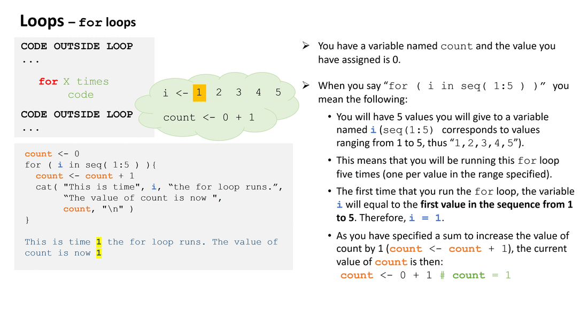
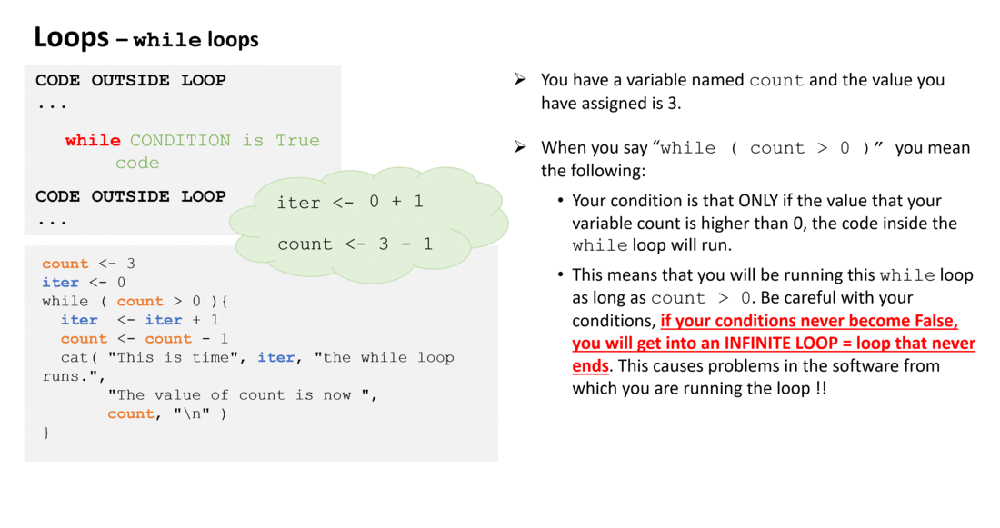

# Introduction to R

As you have seen during the previous session about Python programming,
there are different data types. The same happens when you program in R.
However, there are some differences (but also some similarities)
between Python and R:

### 1. Variables 

<p align="center">
  
</p>

### 2. Operators

<p align="center">
  
</p>


In this practical session, we are going to go through different exercises 
and examples so you become more familiar and comfortable when using these data types
in R. For each of them, there is a specific tutorial with a description about the functions
being used and some exercises so you can practise all the theory you have been learning :smile: 

In order for you to keep track of the exercises you have carried out, we think that you might find it useful to have a separate R script for each tutorial.
Therefore, we have written the R tutorials in Rmarkdown format so you can open the tutorials 
within RStudio and immediately load the examples. 
 
Following the GPP, we recommend that you start each of your R scripts with the following
code or something very similar:

```
# Introduction to R – 190226
# This code contains the material used for the Introduction to R part of the 
# SRUK Scientific Computing course
# Tutorial #X - <write the tutorial here>

# First, we are going to clean the environment to ensure that anything
# from previous sessions is loaded 
rm( list = ls( ) )

# Now we are going to set our working directory. The variable wd will be assigned a specific value: your working directory.
# Therefore, it is going to be a character vector!
wd <- “type_here_the_path_to_your_wd”

# Now, we are going to set our working directory to this path. This means that if you save something, it will be saved in this directory now
setwd( wd )

# We are going to set a specific seed, in case you want to reproduce exactly
# the cases that we are going to be practising here.
# Setting a seed is like putting a label to this code so every single time 
# that you run it you will get the same results. This is very important to 
# use as scientists, as we all want to be working with REPRODUCIBLE results 
# so we can get the same results that another person has obtained! 
# By default, it is an odd number, and people tend to use 12345. However,
# feel free to change this number if you want to. Just make sure you do not 
# change it when you rerun this code! Keep it always the same to always 
# reproduce the same results!

set.seed( 12345 )

# From now onwards, remember to comment why you are doing something and why you are using a specific command. This might helpset our working directory to this path. This means that if you save something, it

```

Accordingly, you can type something like this in each of the Rmarkdown files 
that we have provided in this repo :smile:


# 1. Vector

The first data type we are going to work with is the vector. Remember that there are 6 different types of vectors:

* Logical 
* Numeric
* Integer
* Complex
* Character
* Raw

We are going to have a closer look at each of them, except for the “raw” vector. As introduced during the theory, this type of vector is very specific and the data we are going to be working with does not use it. However, if you are keen on knowing more about the “raw” vector, you can visit [this website](http://stat.ethz.ch/R-manual/R-patched/RHOME/library/base/html/raw.html) for more information.

##	Logical vectors

Logical vectors are used to return either `True` or `False`.
They are very useful if you want to set a specific condition in order to,
for instance, start a function, a loop, print a statement, etc. A summary of 
the operators used for R and a comparison with the ones used in Python 
is shown in the figure below: 

<p align="center">
  
</p>

Now we are going to see more examples so you can keep practising! Click the following 
link to start the tutorial:   

   * [Tutorial to work with logical vectors](https://github.com/sabifo4/II_SRUK_Scientific_Computing/blob/master/PRACTICALS/R_session/Tutorials/Logical_vectors.md)   

## Numeric, integer, and complex vectors

The vectors which value is a number have a different class depending on the kind
of numbers stored: numeric, integer, or complex. You can compare the commands 
used in R and Python in the next figure:

<p align="center">
  
</p>

Get ready to play with some examples so it is easier for you to differentiate them!    

   * [Tutorial to work with numeric, integer, and complex vectors](https://github.com/sabifo4/II_SRUK_Scientific_Computing/blob/master/PRACTICALS/R_session/Tutorials/Numbers_vectors.md)

## Character vectors

Now we are going to study the character vectors.
These vectors contain strings, which are anything enclosed in quotation marks. 
Again, we attach a figure comparing the commands used in R and Python:

<p align="center">
  
</p>

Let’s get started!

* [Tutorial to work with character vectors](https://github.com/sabifo4/II_SRUK_Scientific_Computing/blob/master/PRACTICALS/R_session/Tutorials/Character_vectors.md)

## List vectors 

The last vectors we are going to see are the list vectors. In R, the lists are 
considered vectors, although in other programming languages they can be a 
different data type. A comparison between R and Python commands is shown below:

<p align="center">
  
</p>

Now let's work through more examples in the next tutorial:   

   * [Tutorial to work with list vectors](https://github.com/sabifo4/II_SRUK_Scientific_Computing/blob/master/PRACTICALS/R_session/Tutorials/Lists.md)

## Working with vectors

Your next step is to learn how to access, manipulate, and plot all the vectors
that you have learnt in the previous tutorials. But before, let's revise 
the structure of a condition and the loops you have previously seen in the 
Python session so you see how to use them in R!

### Conditions:

<p align="center">
  
</p>
<p align="center">
  
</p>
<p align="center">
  
</p>
<p align="center">
  
</p>

In comparison with Python, the R syntax for a condition looks like this:

<p align="center">
  
</p>

### Loops:   

Even though you have seen this before, below we show a summary figure with 
the differences between the two kinds of loops:

<p align="center">
     
</p>


   * Explanation of a `for` loop:   

      

   <p align="center">
     
   </p>    
   
   * Explanation of a `while` loop:   

      

   <p align="center">
     
   </p>      
   

Now that you have refreshed conditions and loops, good luck with the next tasks!

* [Tutorial to work with different types of vectors](https://github.com/sabifo4/II_SRUK_Scientific_Computing/blob/master/PRACTICALS/R_session/Tutorials/Working_with_vectors.md)

# 2. Factor
If you want to arrange your data into levels, it is important that the object
that you are working with is of class factor. The figure below shows a comparison 
between the commands used in R and Python:

<p align="center">
  
</p>

Learn how to work with this object in the next tutorial!   

   * [Tutorial to work with objects of class factor](https://github.com/sabifo4/II_SRUK_Scientific_Computing/blob/master/PRACTICALS/R_session/Tutorials/Factors.md)

# 3. Matrix
The first step was learning to work with vectors, which have only one dimension.
The next step is to learn how to work with matrices, which have more than one
dimension! Learn the differences between R and Python in the figure below:

<p align="center">
  
</p>

Remember that matrices are one of the mostly used classes in R to store
the data! 

* [Tutorial to work with objects of class matrix](https://github.com/sabifo4/II_SRUK_Scientific_Computing/blob/master/PRACTICALS/R_session/Tutorials/Matrices.md)

# 4. Data frame
Last, we are going to play with some data frames. The differences between R and 
Python are the following:

<p align="center">
  
</p>

We are going to learn how we can import them from a data file and how we
can save them in our PC! You can start this practical in the tutorial below:   

   * [Tutorial to work with objects of class data frame](https://github.com/sabifo4/II_SRUK_Scientific_Computing/blob/master/PRACTICALS/R_session/Tutorials/Data_frames.md)

# 5. Array 
Even though we are not going to go through a tutorial to work with array objects, it is good that you 
know that they exist. While data frames can have only 2 dimensions, arrays are intended to store 
data in 3 or more dimensions. If you think of a 3D array, the most common type of 
array, we would describe its structure as a combination of a list and a data frame.
First, think of a list with, for instance, 5 elements. Now, when you check the content 
of each element, you see that, instead of a simple numeric vector, you have a matrix or 
a data frame (2D, dimensions `p x n`). This is exactly how an array would look like!

In a 3D array, the first dimension would be the rows of the matrix/data (`p`),
the second dimension the columns of the matrix/data frame (`k`), and the third
dimension the number of total matrices in the array (with our comparison 
above, like the number of entries in a list, `n`).

The comparison between R and Python commands with an example of array is 
shown below:

<p align="center">
  
</p>


If time allows, we will go through a demo to show you an example of how to 
work with arrays :smile: